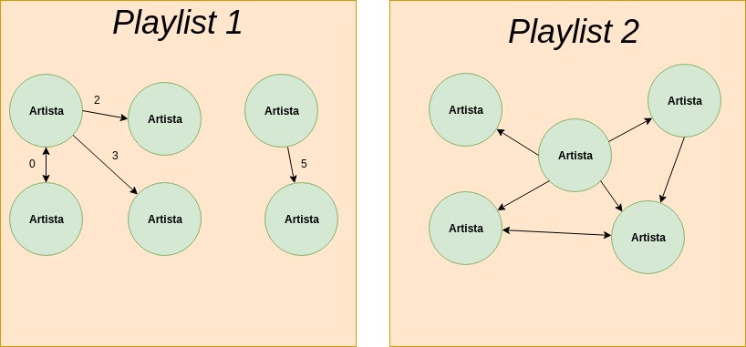

# Prática 1 

#### Grupo: Natan Ribeiro, Raimundo Heitor, Alessandro Fook, Wellington Araújo, Matheus Procópio


## Base de Dados

Para o estudo foram selecionadas duas bases de dados:

- A primeira base de dados selecionada para o estudo corresponde a um subconjunto de listas de músicas (*playlists*) do *vagalume*, que contém informações sobre as músicas nela contidas e os artistas relacionados com cada música seguindo o modelo abaixo:

```bash
class Playlist {
    name: string,
    musics: music[]
}

class Music {
    name: string,
    artists: Artist[]
}
```

- A segunda base de dados, contém os artistas com sua lista de artistas relacionados, seguindo o modelo abaixo:

```bash
class Artist {
    nome: string,
    relacionados: Artist[]
}
```
## Contexto

O *vagalume* tem um serviço de execução de playlist, então como serviço adicional, quando as músicas da lista já terminaram de ser executadas, o serviço costuma recomendar músicas com base nas relações existentes entre músicas e artistas, ou entre playlists.

## Grafo

O grafo gerado pelos dados será construído considerando os artistas, como vértices, que estão conectados por arestas direcionadas entre si, com peso contabilizando o número de playlists em que ambos fazem parte, como podemos visualizar na imagem abaixo:



Dessa forma obtemos uma um dígrafo. Nesse digrafo temos que, uma playlist que 'possui' um artista assim como 'possui' uma música. Um artista, por sua vez, 'possui' uma música. Então, se existirem conjuntos de artistas que não se relacionam, teremos grafos desconectados.

## Perguntas a serem respondidas

**1. Qual ou quais os artistas mais indicados a ser executado após o termino da *playlist*, ou seja, qual vértice de artista que não está presente na *playlist*, mas encontra-se conectado ao vértice de um, ou mais, artista(s) já relacionado(s) *playlist* e que tem o maior grau de proximidade(*playlists* em comum)?**
 
**2. Existem artistas exclusivos, aqueles que estão contidos em apenas uma *playlist*? Dados dois artistas, que não estão na lista de relacionados entre si, é possível caminhar de um até o outro usando o grafo?**

**3. Quais *playlists* formam grafos conectados e quais são heterogênios considerando os artistas que as compõem?**

**4. Qual(ais) o(s) artista(s) mais popular(es), aquele presente em mais *playlists*?**
