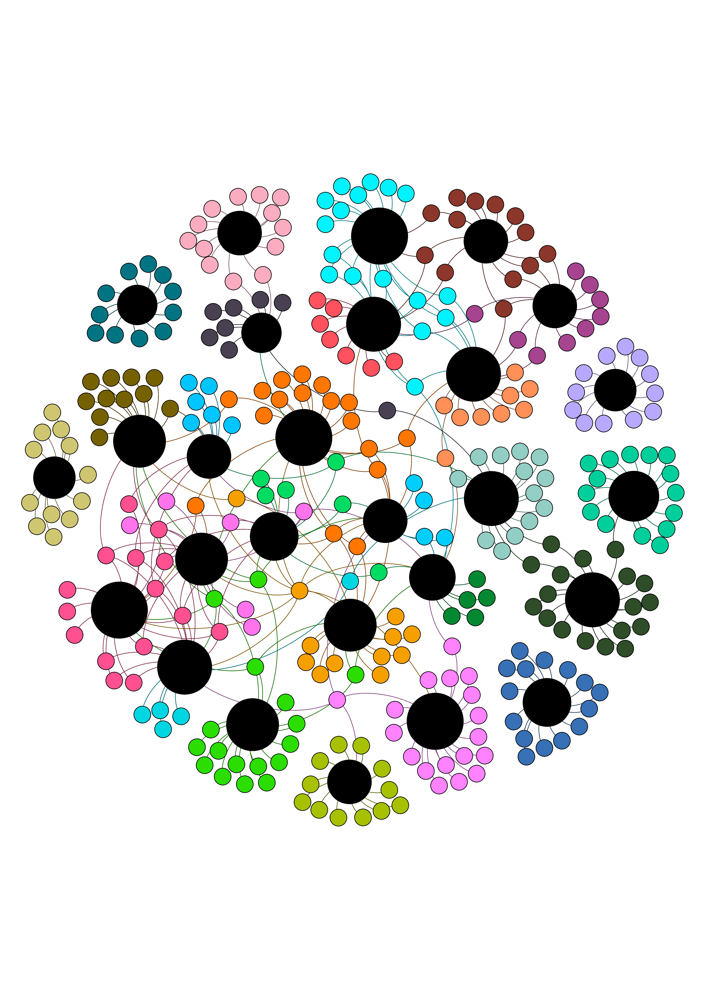
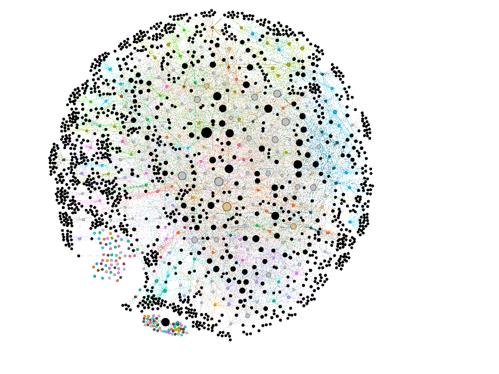
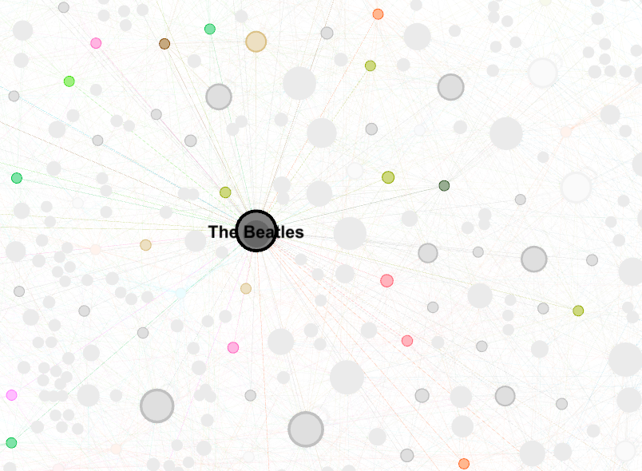

# Spotigraphs


#### Grupo: Natan Ribeiro, Raimundo Heitor, Alessandro Fook, Wellington Araújo, Matheus Procópio


## Contextualização

O Vagalume é um portal de música do Brasil criado em 2002, que utiliza a linguagem PHP e possui o banco de dados MySQL para inicialmente criar uma pequena base de letras de músicas. 

Nele, existe um serviço de streaming de músicas que tem a opção de execução de *playlists* onde, ao final da execução de uma certa *playlist*, o serviço costuma recomendar músicas com base nas relações existentes entre músicas e artistas, ou entre playlists.

Dessa forma, para o estudo proposto, utilizamos como base de dados um subconjunto de listas de músicas (*playlists*) do vagalume a partir da aplicação de um conjunto de filtros na [base de dados](https://media.githubusercontent.com/media/felipevieira/computacao-e-musica-lsd/master/sbcm-2017/Datasets/MPSD%20v1.0.csv) utilizando a linguagem R, conforme código a seguir:

* Importando a biblioteca
```{r setup, include=FALSE}
setwd("~/Documents/workspace/spotigraphs/docs")
library(magrittr)
library('rvest')
```
* De uma grande estrutura, filtrar e selecionar alguns artistas.
```{r}
#Manipulate dataframe to remove unnecessary information
dataframe <- read.csv("spotigraph-database.csv") 
keeps <- c("artist_name", "playlist_name")
dataframe2 <- dataframe[keeps] %>% unique
dataframe3 <- dataframe2[!grepl(",|&", dataframe2$artist_name),]
dataframe4 <- dataframe3[grep("^[A-Za-z]+$", dataframe3$artist_name),]

#Create a dataframe to use as filter
frame_filter1 <- as.data.frame(table(unlist(dataframe4$playlist_name)))
frame_filter2 <- frame_filter1[!grepl("Playlist|,|\"|[|]", frame_filter1$Var1),]
frame_filter3 <- frame_filter2[grep("Top", frame_filter2$Var1),]
frame_filter4 <- subset(frame_filter3, subset = (Freq > 10 & Freq < 20))

#Filter dataframe and save to a csv file
subset1 <- subset(dataframe4, playlist_name %in% frame_filter4$Var1)
write.csv(subset1, file = "artist-playlist.csv", row.names = FALSE)
subset2 <- aggregate(subset1$playlist_name,subset1['artist_name'],paste,collapse=',')
colnames(subset2) <- c("artist", "playlists")


#Specifying the url for desired website to be scrapped
url_base <- 'https://www.vagalume.com.br/'
url_rest <- '/relacionados/'

#Scraping related artists 
subset2["related"] <- NA

subset3 <- data.frame(cbind('a', 'a'))
colnames(subset3) <- c('artist', 'related')
subset3[,1] <- NA
subset3[,2] <- NA
subset3 <- subset3[complete.cases(subset3),]

for (i in 1:dim(subset2)[1]) {

  relacionados <- tryCatch({html_nodes(read_html(paste(url_base,gsub(" ", "-",tolower(as.character(subset2$artist[i]))),url_rest, sep = "")),'p.h22.w1.itemTitle') %>% html_text},error=function(cond){message(cond)})

  subset2$related[i] <- paste(unlist(list(relacionados)), collapse = ",")

  related = c()

  if(paste(unlist(list(relacionados)), collapse = ",") == "") {
    related = c(NA)
  } else {
    related <- list(relacionados)
  }

    subset4 <- data.frame(matrix(subset2$artist[i]), related)
    colnames(subset4) <- c('artist', 'related')

    subset3 <- merge(subset3, subset4, by = intersect(names(subset3), names(subset4)), all.x = TRUE, all.y = TRUE)

}

write.csv(subset3, file = "filter-artist-related.csv", row.names = FALSE)
write.csv(subset2, file = "filter-artists.csv", row.names = FALSE)
```

Como resultado desses sucessivos filtros, obtivemos essa [base de dados](../docs/filter-artists.csv) que nos responderá os questionamentos propostos no próximo tópico.


## Problemas

Para se realizar a análise do grafo definimos como vértices os artistas que será interligados entre si por uma aresta, onde o nó alvo é um artista presente na lista de relacionados do nó fonte.

Tal estrutura nos permite iterar sobre os vértices e encontrar as repostas para as perguntas a seguir. Abaixo temos as questões propostas e como pretendemos usar dos dados e da teoria dos grafos para solucioná-los.

**1. Qual ou quais os artistas mais indicados a ser(em) executado(s) após o término da *playlist*, ou seja, qual vértice que não está presente na *playlist*, mas encontra-se conectado ao vértice de um, ou mais, artista(s) já relacionado(s) a *playlist* e que tem o maior grau de proximidade(*playlists* em comum)?**

- Motivo: Esse é um problema recorrente em sistemas de transmissão de mídias e que tem como principal propósito manter o usuário acessando o sistema sem haver uma interrupção do serviço. Porém para se evitar um contraste de estilos entre o que está em reprodução e o que o sistema sugere se torna necessário um algoritmo que busque sempre os mais apropriados para serem adicionados/sugeridos a playlist. Tal algoritmo é o que desejamos encontrar para resolver este problema.

- Metodologia: Neste problema temos como objetivo encontrar um vértice, que representa um artista, o qual não esteja presente no conjunto de vértices incluídos na playlist e que tenha o maior grau de proximidade com a mesma. O grau de proximidade é definido como o número de vezes que um artista, não contido no conjunto da playlist, aparece no conjunto de relacionados dos artistas pertencentes a playlist. Ou seja para cada artista da playlist verifica os seus artistas relacionados e aqueles que não estiverem na playlist são selecionados como possíveis candidatos a indicações, depois que todos os artistas forem verificados poderá observar aqueles que mais se repetiram dentre os candidatos indicados e com isso realizar uma sugestão mais apropriada.


**2. Existem artistas exclusivos, aqueles que estão contidos em apenas uma *playlist*? Dados dois artistas, que não estão na lista de relacionados entre si, é possível caminhar de um até o outro usando o grafo?**

- Motivo: A ideia desse problema é encontrar quais os artistas mais isolados, ou seja, aqueles que tem menos proximidade com os outros. A descoberta de tais artistas se torna útil para o cadastro de novos artistas semelhantes ou relacionados no sistema e com isso impedir, ou minimizar, a ocorrência artistas isolados. Por outro lado, torna possível expandir a oferta de artistas para os clientes, tornando o algoritmo da questão anterior mais eficiente, e permitindo a captação de sucessos regionais momentâneos, onde novos artistas surgem, concedendo ao sistema a capacidade de se adaptar a uma tendência.

- Metodologia: Neste problema será feita uma varredura entres os artistas, verificando se existem artistas exclusivos a uma única *playlist*. Por outro lado, verifica-se dados dois artistas se existe um caminho entre eles, o que possibilitaria a criação de uma nova *playlist* no sistema, com todos os nós pertencentes ao caminho.


**3. Considerando os artistas que compõem um *playlist*, e suas listas de relacionados, quais *playlists* já encontram-se relacionadas, e quais podem ser interligadas ao se adicionar um novo artista presente na lista de relacionados dos já pertencentes a *playlist*?**

- Motivo: Esse problema tem como objetivo identificar quais as *playlists* mais coesas, ou seja, aquelas cujos artistas têm relações com outros membros da mesma *playlist*, identificando assim um conjunto que pode representar um determinado gênero, região ou período temporal de relacionamento dos artistas.

- Metodologia: Ao percorrer o grafo é possível agrupar os artistas por seus relacionamentos entre si e com as playlists, verificando assim se existe agrupamento ou concentração de playlists em torno de um determinado grupo de artistas que irão indicar a existência de um relação forte, seja por gênero, região ou período, e por outro lado será possível identificar as *playlists* que serão folhas ou estarão isoladas, demonstrando que não pertencem a nenhum dos grupos da amostra.

**4. Qual(ais) o(s) artista(s) mais popular(es), aquele presente em mais *playlists* e aquele mais presente na lista de relacionados?**

- Motivo: Outro problema bastante comum em sistemas de mídia é determinar quais as tendências do momento, ou seja, quais os artistas que estão fazendo mais sucesso.

- Metodologia: Essa problema pode ser resolvido fazendo uma intersecção entre as *playlist* e obtendo os artistas mais comuns a todas, ou aqueles que tem o maior grau de entrada.


## Grafo

Para visualização e manipulação gráfica dos nossos dados utilizamos a ferramenta *Gephi*, que constitui em um *software* de análise e visualização de redes de código aberto escrito em Java.

Com os dados coletados e referenciado anteriormente, foi utilizada uma das bases de dados derivadas do filtro principal com nome [artist-playlist-related.csv](../docs/graph/artist-playlist-related.csv) que contém uma tabela com duas colunas, na primeira é composta pelos artistas para cada *playlist* em que ele é referenciado, sendo esta a entrada da segunda coluna. Assim geramos o seguinte grafo:



Este grafo contém 333 nós e 418 arestas. O grafo foi montado para se verificar a viabilidade das **questões 2 e 3** onde se busca verificar a existência de artistas conectados a apenas um *playlist* e o agrupamento de *playlists* em torno de determinados artistas.

Assim, pela imagem acima podemos perceber que os dois questionamentos irão encontrar resultados válidos, pois podemos perceber que alguns artistas estão isolados em torno de uma *playlist* nas periferias da imagem, e um conjunto de *playlists* encontra-se concentrada em torno de alguns artistas no centro da imagem.

No grafo a seguir, geramos uma outra tabela ([artist-playlist-nodes.csv](../docs/graph/artist-playlist-nodes.csv)) contendo os nós, e utilizamos a tabela do grafo anterior
([artist-all-related.csv](../docs/graph/artist-all-related.csv)) para obtermos as arestas. Assim, temos o grafo abaixo:



Neste segundo grafo, obtemos 1757 nós e 5817 arestas. Neste caso, temos os nós de cor preta, como artistas não relacionados a alguma *playlist*. Assim como no grafo anterior, os nós maiores, possuem grau de entrada maior. A partir da imagem podemos buscar soluções para as **questões 1 e 4**, onde podemos avaliar os relacionamentos entre os artistas.

Temos a seguir, um exemplo de que tipo de informação podemos obter:



Fica claro que este nó **The Beatles** é o maior, e como definimos anteriormente, o diâmetro de um nó é proporcional ao grau do mesmo, o que já indica o artista como sendo um dos mais populares.


## Implementação

Para representar o grafos definidos na seção anterior, foi utilizado o [repositório](https://github.com/matheusps/spotigraphs) do github que já vinha armazenando os algoritmos de coleta e filtragem de dados.

Assim, foi utilizada uma biblioteca *Java* gratuita para trabalhar com algoritmos de grafos indicada pelo professor e chamada [*JGraphT*](https://jgrapht.org/).

A biblioteca foi utilizada inicialmente para construir um grafo simples, o que demandou muito esforço para aprender o básico da ferramenta, uma vez que, não existem exemplos de uso da documentação.

Apesar disto, após se obter alguma compreensão sobre as noções básicas da biblioteca, foi desenvolvido um pequeno projeto utilizando o *Maven* para importar a biblioteca, com o objetivo de construir um grafo simples conforme foi proposto anteriormente, o que se mostrou simples de executar.

Primeiro, as informações coletadas foram armazenadas em memória através da criação de objetos que as representassem: 

- [Playlist](../spotigraph/src/main/java/org/spotigraph/Playlist.java)
- [Artista](../spotigraph/src/main/java/org/spotigraph/Artist.java)

Então foram desenvolvidos dois arquivos utilitários, um para realizar a leitura dos [dados](../spotigraph/src/main/java/org/spotigraph/IOUtils.java) coletados anteriormente, e outro para executar a criação do [grafo](../spotigraph/src/main/java/org/spotigraph/GraphUtils.java).

Em continuidade, foi criado um [arquivo](../spotigraph/src/main/java/org/spotigraph/App.java) que seria responsável por gerenciar todos os demais, e a partir de onde a aplicação seria iniciada.


## Resultados e Discussões
```
- Etapas:
1. Utilizar o ferramental fornecido pelo JGraphT para responder as perguntas
selecionadas.
2. Analisar e discutir os resultados obtidos.

- O que deve ser entregue?
Esta seção deve incluir a descrição das técnicas usadas (algoritmos, conceitos, etc) para
resolver cada pergunta, bem como apresentar e discutir os resultados alcançados.
```

Como os resultados obtidos após a especificação, coleta e manipulação dos dados, podemos responder os questionamentos anteriormente definidos além de listar fatores interessantes analisando tais resultados.

Primeiramente, é importante frisar, que temos um tamanho não muito denso já que tratando-se da temática musical, domínio repleto de artistas dos incontáveis estilos musicais ao redor do mundo, o tamanho da amostra é razoável e talvez não traduza um resultado coerente numa escala mundial.

Para respondermos os questionamentos prospostos, criamos uma clase [Problems](../spotigraph/src/main/java/org/spotigraph/Problems.java) onde conterá metodos para responder cada questão além de uma outra classe, chmada [OrderObject](../spotigraph/src/main/java/org/spotigraph/util/OrderObject.java), que ordena os elementos de determinada estrutura de dados.

Com isso, para o primeiro questionamento, utilizamos o método *problem1Solver(Playlist currentPlayList)* que dada uma *playlist* como entrada, o seu retorno é uma lista ordenada dos artistas mais indicados para, por exemplo, continuar a execução das músicas a partir da relação entre artistas. Assim para cada artista na playlist, adiciona-se um vértice para o artista e, para cada artista relacionado, adiciona-se um vértice para o artista relacionado e pode ou não adicionar uma aresta entre os o artista da playList e o relacionado. Com isso é cria-se um um rankeamento dos artistas resultantes com maior afinidade, a partir do grau de relação (quantidade de vértices) entre tais artistas.

Como exemplo executamos o código logo abaixo que teve como resultado (para os dados utilizados neste estudo) uma lista repleta de artistas, aos quais, apresentamos uma pequena porção:

*	Código Exemplo:
```{Java}
Chamada do Método:
	System.out.println(Problems.problem1Solver(playlistMap.get("Tops")));
    
Resultado:
	[Demi Lovato, Britney Spears, Glee, Chris Brown, Shakira, Selena Gomez, Jennifer Lopez, Beyoncé, Miley Cyrus, Pitbull, Jessie J, Justin Bieber, David Guetta, Maroon 5, Black Eyed Peas, ...]
```

